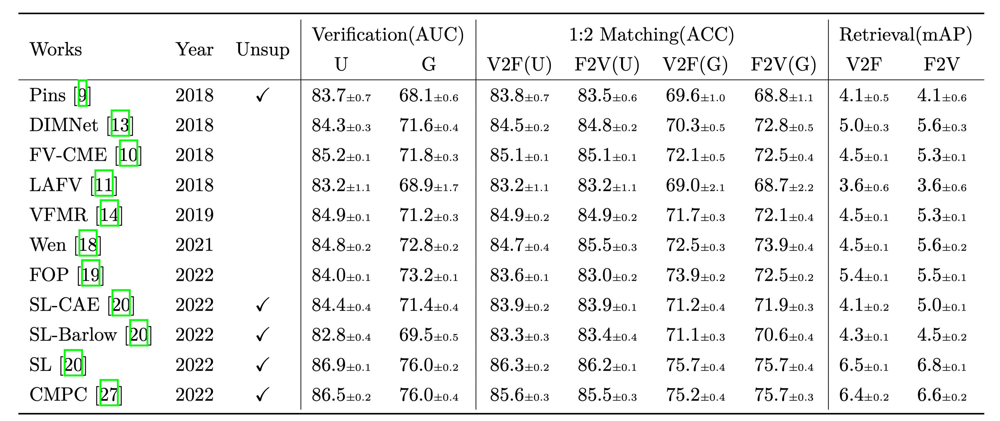

# Voice-Face Association Learning Evaluation
- Reproduce bunches of  works based on unified standards  😃
- High-speed  training and testing ⚡
- Easy to extend 💭


## Installation 

1. Clone\download this repo

2. Install requirements

```
pytorch>=1.8.1
wandb>=0.12.10
```

3. Download dataset 

Download `dataset.zip` from [GoogleDrive](https://drive.google.com/file/d/1sVQ7I4_9rwWF18vk4VZFVAx-8Inv-wlT/view?usp=sharing) (2.3GB) and unzip it to the project root.  The folder structure is shown below:

```
dataset
├── evals
│   ├── test_matching_10.pkl
│   ├── test_matching_g.pkl
│   ├── test_matching.pkl
│   ├── test_retrieval.pkl
│   ├── test_verification_g.pkl
│   ├── test_verification.pkl
│   └── valid_verification.pkl
├── info
│   ├── name2gender.pkl
│   ├── name2jpgs_wavs.pkl
│   ├── name2movies.pkl
│   ├── name2voice_id.pkl
│   ├── train_valid_test_names.pkl
│   └── works
│       └── wen_weights.txt
├── face_input.pkl
└── voice_input.pkl
```


Dataset Description

> The dataset is based on VoxCeleb and is  divided according to "Learnable pins: Crossmodal embeddings for person identity,2018,ECCV"   ( 901/100/250 for train/valid/test )
>
> The face images and voice clips are extracted as vector representations in advance to improve the training speed (`face_input.pkl,voice_input.pkl`).  These features are released by "Self-Lifting: A Novel Framework for Unsupervised Voice-Face Association Learning,ICMR,2022".
> Since the dataset split in Self-Lifting (924/112/189) differs from this project,  the results are not comparable.

## Run a production

- Learnable pins: Crossmodal embeddings for person identity,2018,ECCV

​	``python works/1_pins.py``


- Face-voice matching using cross-modal embeddings,MM,2018

​	`python works/2_FV-CME.py`


- On learning associations of faces and voices,ACCV,2018,

​	`python works/3_LAFV.py`


- Disjoint mapping network for cross-modal matching of voices and faces,ICLR,2019

​	`python works/11_SS_DIM_VFMR_Barlow.py --name=DIMNet `  


- Voice-Face Cross-modal Matching and Retrieval- A Benchmark,2019

​	`python works/11_SS_DIM_VFMR_Barlow.py --name=VFMR `  


- Seeking the Shape of Sound- An Adaptive Framework for Learning Voice-Face Association,CVPR,2021

​	`python works/5_Wen.py`


- Fusion and Orthogonal Projection for Improved Face-Voice Association,ICASSP,2022

​	`python works/6_FOP.py`


- Unsupervised Voice-Face Representation Learning by Cross-Modal Prototype Contrast,IJCAI,2022

​	`python works/7_CMPC.py`


- Self-Lifting: A Novel Framework for Unsupervised Voice-Face Association Learning,ICMR,2022

​	`python works/9_SL.py` for self-lifting 

​	`python works/8_CAE.py` for the CCAE baseline 

​	`python works/11_SS_DIM_VFMR_Barlow.py --name=SL-Barlow `  for the Barlow Twins baseline 


## Integration with Wandb

*use [wandb](https://wandb.ai) to view the training process:*

1. Create  `.wb_config.json`  file in the project root, using the following content:

   ```
   {
     "WB_KEY": "Your wandb auth key"
   }
   ```

   

2. add `--dryrun=False` to the training command, for example:   `python main.py --dryrun=False`


## Results




